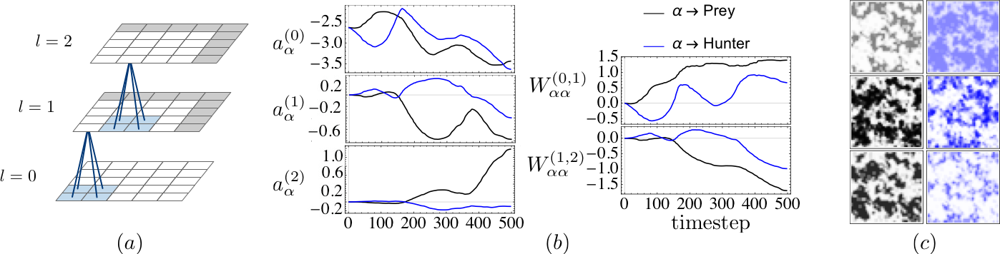

# Deep learning moment closure approximations using dynamic Boltzmann distributions

## Abstract

The moments of spatial probabilistic systems are often given by an infinite hierarchy of coupled differential equations. Moment closure methods are used to approximate a subset of low order moments by terminating the hierarchy at some order and replacing higher order terms with functions of lower order ones. For a given system, it is not known beforehand which closure approximation is optimal, i.e. which higher order terms are relevant in the current regime. Further, the generalization of such approximations is typically poor, as higher order corrections may become relevant over long timescales. We have developed a method to learn moment closure approximations directly from data using dynamic Boltzmann distributions (DBDs). The dynamics of the distribution are parameterized using basis functions from finite element methods, such that the approach can be applied without knowing the true dynamics of the system under consideration. We use the hierarchical architecture of deep Boltzmann machines (DBMs) with multinomial latent variables to learn closure approximations for progressively higher order spatial correlations. The learning algorithm uses a centering transformation, allowing the dynamic DBM to be trained without the need for pre-training. We demonstrate the method for a Lotka-Volterra system on a lattice, a typical example in spatial chemical reaction networks. The approach can be applied broadly to learn deep generative models in applications where infinite systems of differential equations arise.

## Code & directions

A complete description of the code can be found on the [GitHub page's](https://github.com/physics-based-ml/ReducedLotkaVolterra) Readme files.