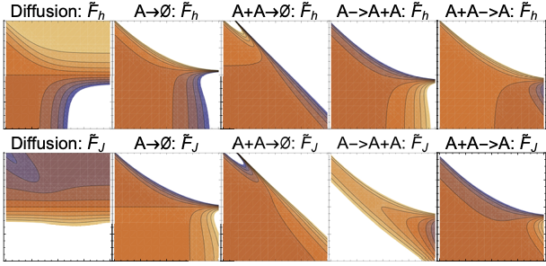

# Learning dynamic Boltzmann distributions as reduced models of spatial chemical kinetics

## Publication

[J. Chem. Phys. 149, 034107 (2018)](https://aip.scitation.org/doi/10.1063/1.5026403)

## Abstract

Finding reduced models of spatially distributed chemical reaction networks requires an estimation of which effective dynamics are relevant. We propose a machine learning approach to this coarse graining problem, where a maximum entropy approximation is constructed that evolves slowly in time. The dynamical model governing the approximation is expressed as a functional, allowing a general treatment of spatial interactions. In contrast to typical machine learning approaches which estimate the interaction parameters of a graphical model, we derive Boltzmann-machine like learning algorithms to estimate directly the functionals dictating the time evolution of these parameters. By incorporating analytic solutions from simple reaction motifs, an efficient simulation method is demonstrated for systems ranging from toy problems to basic biologically relevant networks. The broadly applicable nature of our approach to learning spatial dynamics suggests promising applications to multiscale methods for spatial networks, as well as to further problems in machine learning.

## Code & directions

A complete description of the code can be found on the [GitHub page's](https://github.com/physics-based-ml/DyBoltzReducedModelsPaper) Readme files. All code is written in Mathematica notebooks.