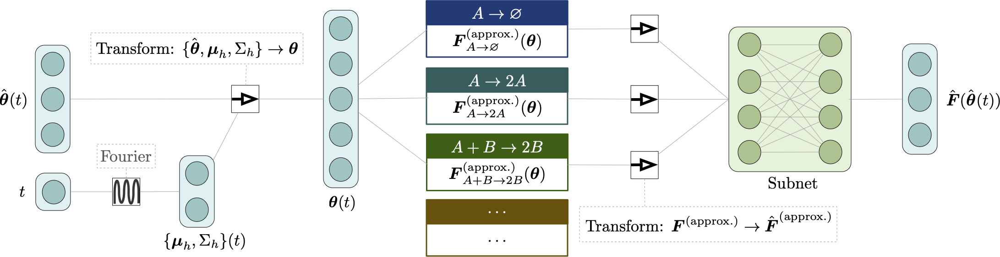

# Physics-based machine learning for modeling stochastic IP3-dependent calcium dynamics



[](https://github.com/smrfeld/physics-based-ml-reaction-networks)
[](XXX)

## Abstract

We present a machine learning method for model reduction which incorporates domain-specific physics through candidate functions. Our method estimates an effective probability distribution and differential equation model from stochastic simulations of a reaction network. The close connection between reduced and fine scale descriptions allows approximations derived from the master equation to be introduced into the learning problem. This representation is shown to improve generalization and allows a large reduction in network size for a classic model of inositol trisphosphate (IP3) dependent calcium oscillations in non-excitable cells.

## Code & directions

A complete description of the code can be found on the [GitHub page's](https://github.com/smrfeld/physics-based-ml-reaction-networks) Readme files.

### Requirements

* **Requires Mathematica v12 or later**
* [Data version control (DVC)](https://dvc.org) to download data generated for the paper (else, you will have to run everything from scratch!): 
```
brew install dvc
```

### Download

Either:
* Grab the [latest release .zip](https://github.com/smrfeld/physics-based-ml-reaction-networks/releases), **or**
* Clone the repo: 
```
git clone https://github.com/smrfeld/physics-based-ml-reaction-networks/releases
```

### Directions

* [Stochastic simulations](https://github.com/smrfeld/physics-based-ml-reaction-networks/tree/main/stochastic_simulations/ml_training_data).
* [Analytic forms of reaction approximations](https://github.com/smrfeld/physics-based-ml-reaction-networks/tree/main/learn_ip3/analytic_forms).
* [Train ML models that generalize in IP3 concentration](https://github.com/smrfeld/physics-based-ml-reaction-networks/tree/main/learn_ip3).
* [Train ML models that generalize in IP3R concentration](https://github.com/smrfeld/physics-based-ml-reaction-networks/tree/main/learn_ip3r).