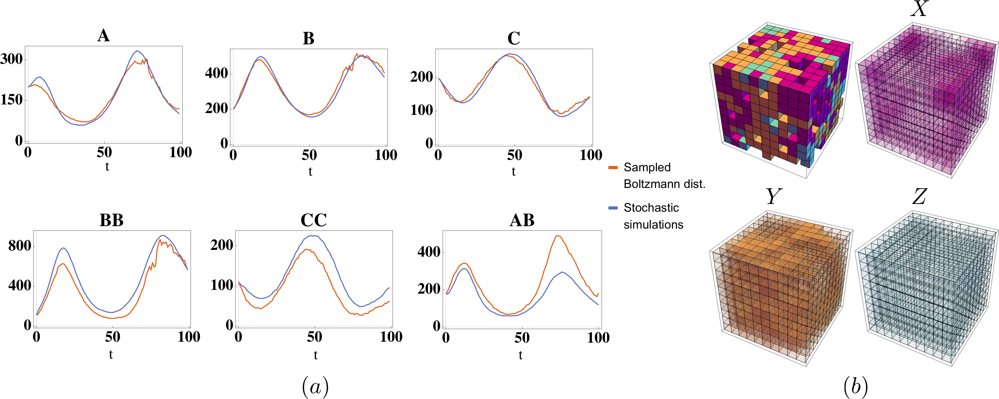

# Learning moment closure in reaction-diffusion systems with spatial dynamic Boltzmann distributions

## Publication

[Phys. Rev. E 99, 063315](https://journals.aps.org/pre/abstract/10.1103/PhysRevE.99.063315)

## Abstract

Many physical systems are described by probability distributions that evolve in both time and space. Modeling these systems is often challenging due to their large state space and analytically intractable or computationally expensive dynamics. To address these problems, we study a machine-learning approach to model reduction based on the Boltzmann machine. Given the form of the reduced model Boltzmann distribution, we introduce an autonomous differential equation system for the interactions appearing in the energy function. The reduced model can treat systems in continuous space (described by continuous random variables), for which we formulate a variational learning problem using the adjoint method to determine the right-hand sides of the differential equations. This approach can be used to enforce a reduced physical model by a suitable parametrization of the differential equations. The parametrization we employ uses the basis functions from finite-element methods, which can be used to model any physical system. One application domain for such physics-informed learning algorithms is to modeling reaction-diffusion systems. We study a lattice version of the Rössler chaotic oscillator, which illustrates the accuracy of the moment closure approximation made by the method and its dimensionality reduction power.

## Code & directions

A complete description of the code can be found on the [GitHub page's](https://github.com/physics-based-ml/DynamicBoltzmannPaper.git) Readme files.